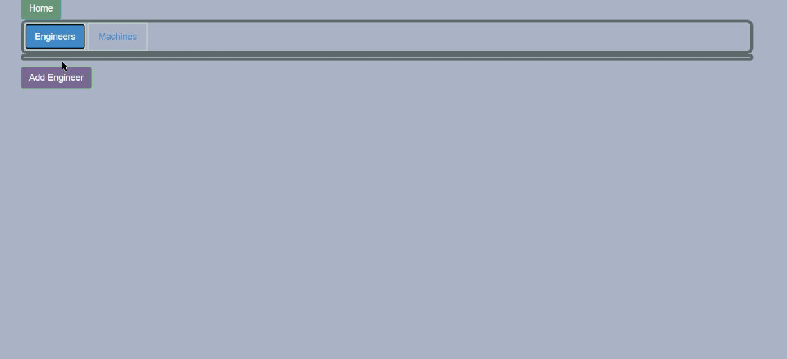

# _SillyStringzFactory_

#### _DATE 01.08.2021_

#### By _** Patrick Osten **_

## Description
- This application was made as part of the Epicodus Coding bootcamp coursework.

This application will allow a manager of a factory to register Engineers and Machines, and create many to many relationships between them. You can view all engineers, machines, and assign as many Engineers to as many Machines as you want as many time as you want.



## Setup/Installation Requirements

<details>

Software Requirements
* An internet browser of your choice; I prefer Chrome
* A code editor; I prefer VSCode
* .NET Core
* MySQL Workbench

Open by Downloading or Cloning
* Navigate to <https://github.com/POsten040/SillyStringzFactory>
* Download this repository to your computer by clicking the green Code button and 'Download Zip'
* Or clone the repository with `git clone https://github.com/POsten040/SillyStringzFactory`

AppSettings
* This project requires an AppSettings file. Create your `appsettings.json` file in the main `SillyStringzFactory` directory. 
* Format your `appsettings.json` file as follows including your unique password that was created at MySqlWorkbench installation:
```
{
  "ConnectionStrings":{
      "DefaultConnection": "Server=localhost;Port=3306;database=p-osten;uid=root;pwd=<YourPassword>;"
  }
}
```
* Update the Server, Port, and User ID as needed.

</details>

## Launching the Application
* Navigate to SillyStringzFactory.Solution/SillyStringzFactory and type `dotnet restore` into the terminal
* Then, in the same project folder, type `dotnet ef database update` to create the database. 
* To open in your browser type `dotnet run` 

## User Stories
<details>

| User Stories                                                                                                                                                                                                                                                               |   |
|----------------------------------------------------------------------------------------------------------------------------------------------------------------------------------------------------------------------------------------------------------------------------|---|
| As the factory manager, I need to be able to see a list of all engineers, and I need to be able to see a list of all machines.                                                                                                                                             |   |
| As the factory manager, I need to be able to select a engineer, see their details, and see a list of all machines that engineer is licensed to repair. I also need to be able to select a machine, see its details, and see a list of all engineers licensed to repair it. |   |
| As the factory manager, I need to add new engineers to our system when they are hired. I also need to add new machines to our system when they are installed.                                                                                                              |   |
| As the factory manager, I should be able to add new machines even if no engineers are employed. I should also be able to add new engineers even if no machines are installed                                                                                               |   |
| As the factory manager, I need to be able to add or remove machines that a specific engineer is licensed to repair. I also need to be able to modify this relationship from the other side, and add or remove engineers from a specific machine.                           |   |
| I should be able to navigate to a splash page that lists all engineers and machines. Users should be able to click on an individual engineer or machine to see all the engineers/machines that belong to it.                                                               |   |
</details>
<br>

## Known Bugs

This application has no known bugs. 

## Support and contact details

Patrick Osten at <posten.coding@gmail.com>


## Technologies Used

* [Bootstrap Components](https://getbootstrap.com/docs/3.3/components/)
* C#
* Razor
* Entity Framework Core
* MySql Workbench
* .NET Core
* Coffee

### License

[](https://opensource.org/licenses/MIT)

Copyright (c) 2020 **_Patrick Osten_**
